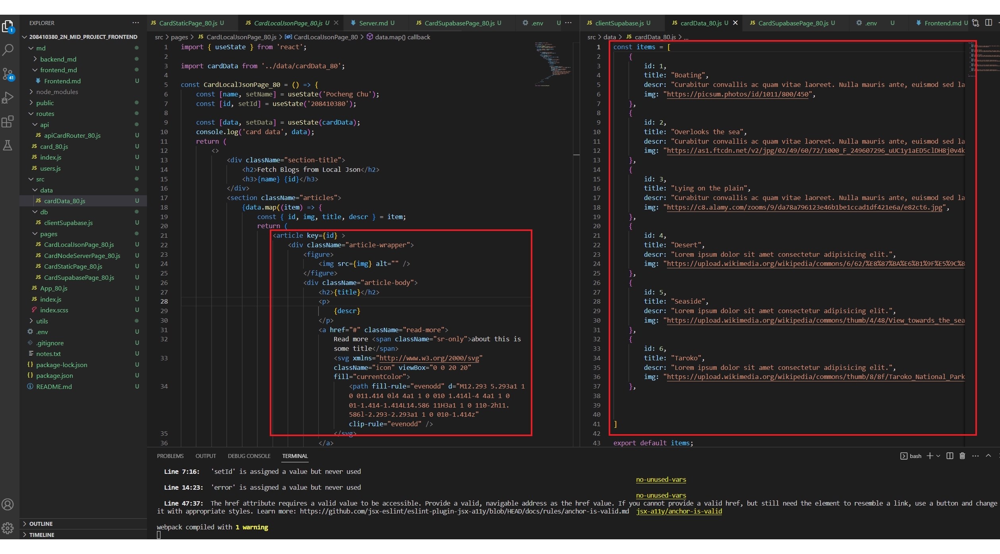
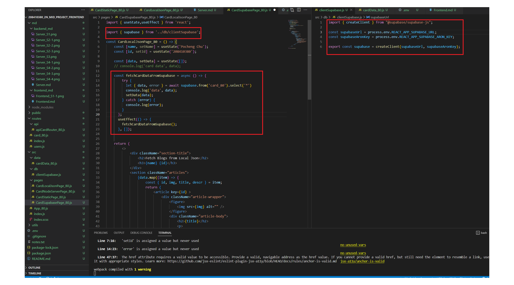

[My GitHub Backend Repo URL](https://github.com/justin40715/208410380_2N_mid_project_frontend) 

### S1. 將前端 theme (html, css)，轉成 React components

### 1.CardLocalJsonPage & LocalJSON


```
f0c0404 justin40715     Thu Mar 30 00:00:19 2023 +0800  S1. 將前端 theme (html, css)，轉成 React components
```
### S3. 可以直接透過  Supabase API 取得React components 所要的json資料
