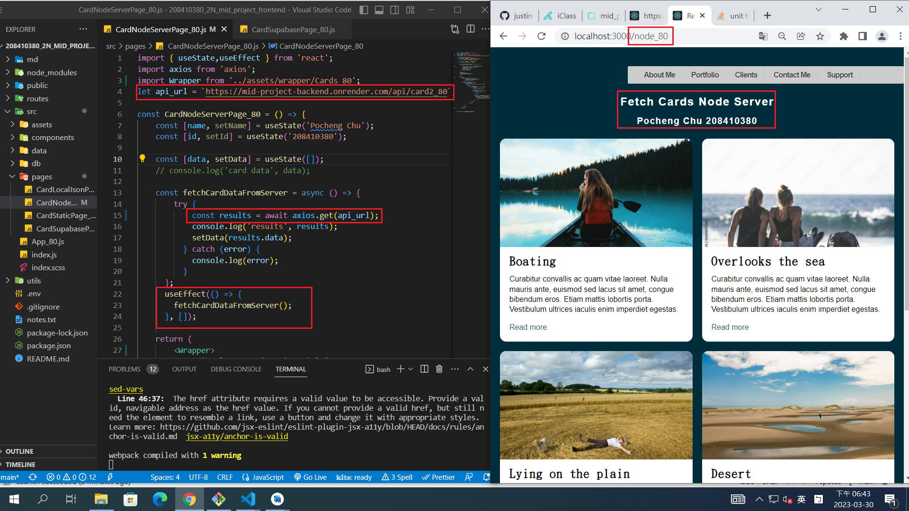
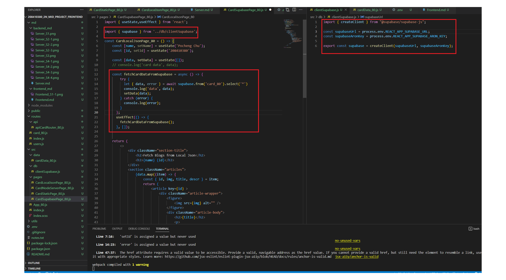
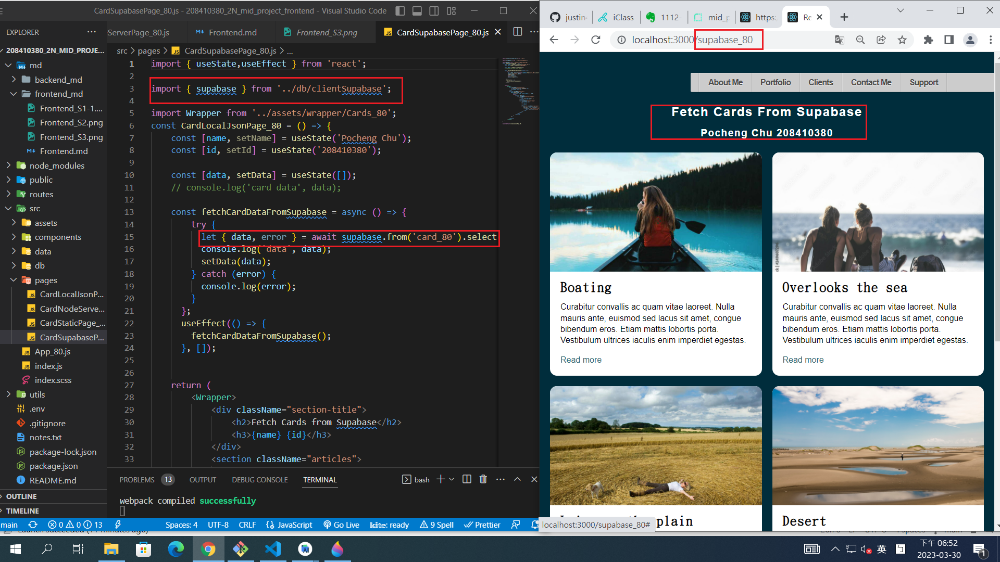
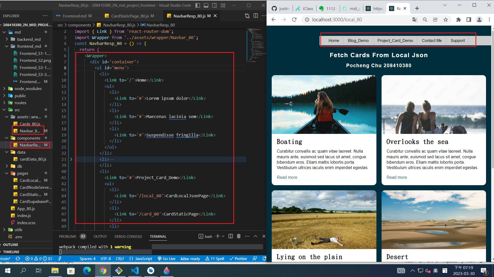
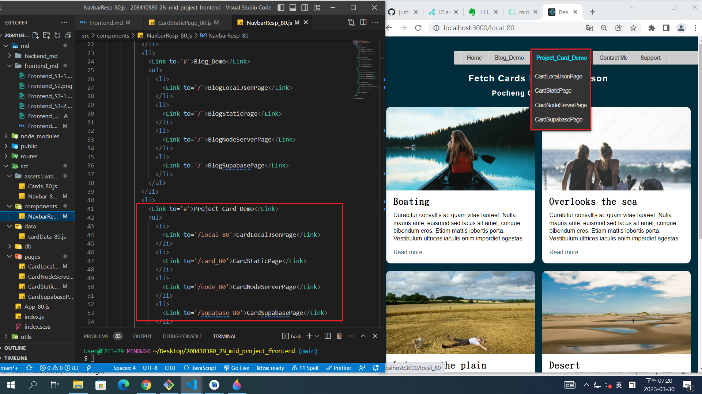
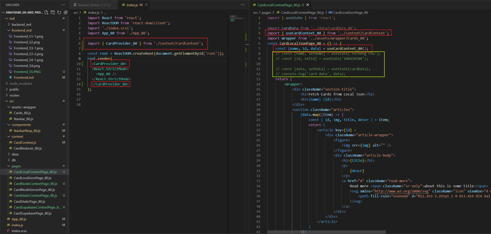
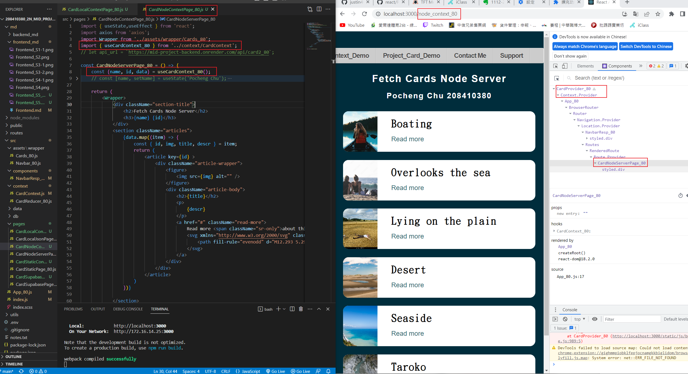

[My GitHub Frontend Repo URL](https://github.com/justin40715/208410380_2N_mid_project_frontend)

### S1. 將前端 theme (html, css)，轉成 React components

### 1.CardLocalJsonPage & LocalJSON


```
f0c0404 justin40715     Thu Mar 30 00:00:19 2023 +0800  S1. 將前端 theme (html, css)，轉成 React components
```

### S2. 可以透過 server api 取得 json 資料，放入 React components



```
497edd6 justin40715     Thu Mar 30 18:47:57 2023 +0800  S2. 可以透過 server api 取得 json 資料，放入 React components
```

### S3. 可以直接透過 Supabase API 取得 React components 所要的 json 資料




```
acc7ce2 justin40715     Thu Mar 30 18:55:06 2023 +0800   S3. 可以直接透過 Supabase API 取得 React components 所要的 json 資料
```

### S4. 請加入選單




```
7d454e7 justin40715     Thu Mar 30 19:25:47 2023 +0800  S4. 請加入選單
```

### S5. 請使用 Context API 及 useReducer 來儲存資料





```
4aa45fd justin40715     Mon Apr 17 23:07:25 2023 +0800  S5. 請使用 Context API 及 useReducer 來儲存資料
```